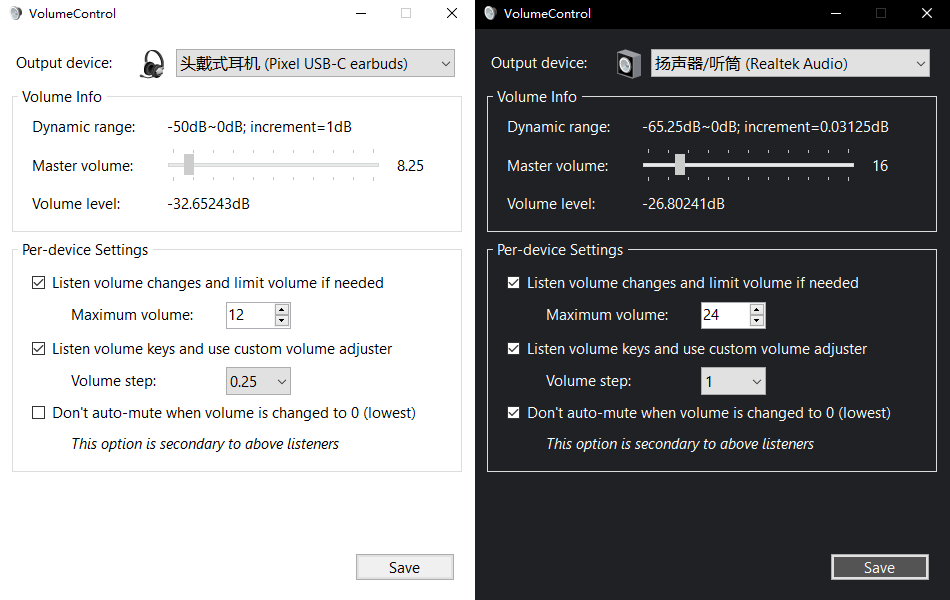

# VolumeControl

Audio volume control daemon for Windows.

## Features

+ Limit volume to fit your maximum tolerance
+ Change volume with smaller/larger volume steps
+ Step down to lowest possible volume

CAUTION::warning:Due to NO GAREANTEE of volume safety, USE AT YOUR OWN RISK!

## Related Efforts

+ [QuietOnTheSet](https://github.com/troylar/quiet-on-the-set)

## License

[MIT](./LICENSE)

